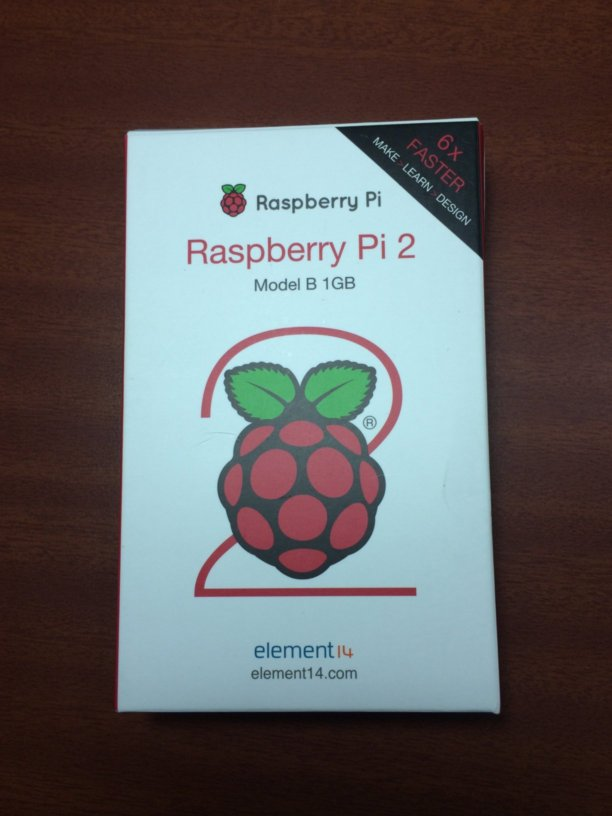
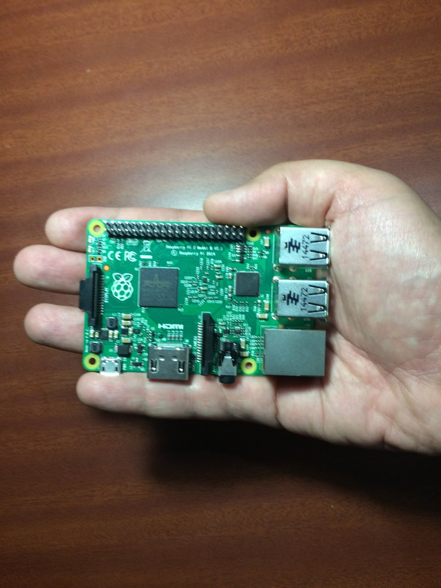
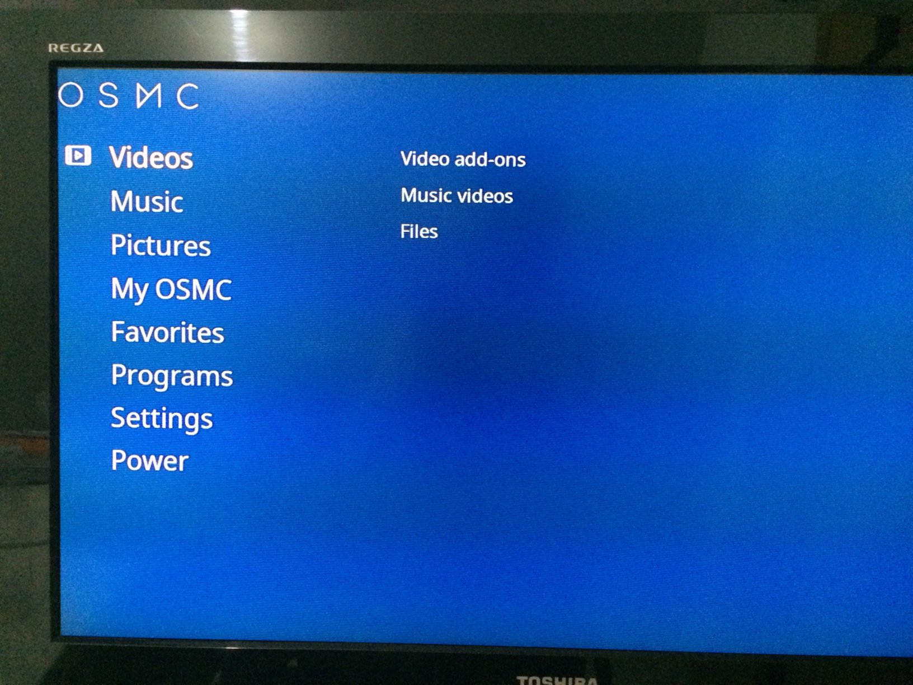
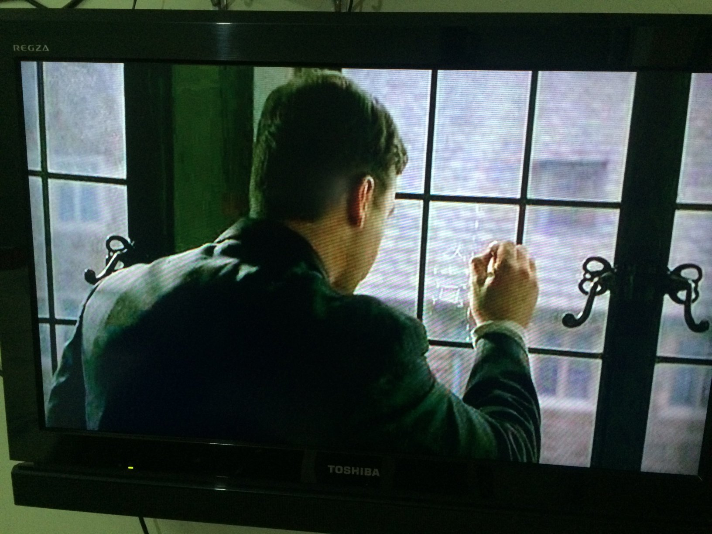
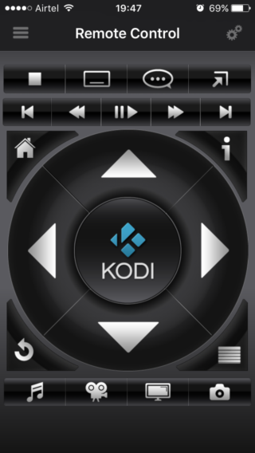
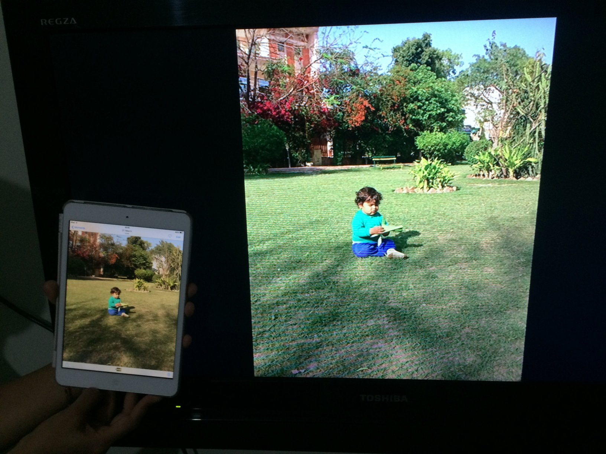

#Booting up my new gadget

I am excited to share the experience of my new posession with you.

Well, a few weeks back I bought a new gadget for myself referred to as Raspberry Pi 2 (alias RP2). As you might be aware, it’s a credit card sized CPU, the smallest one would have ever seen, with minimal but sufficient on board components. It draws power from a mini USB port, boasts of quad-core ARM Cortex-A7 CPU, a VideoCore IV dual-core GPU and 1GB RAM, all under 35$. It boots from a micro-SD card carrying any of the compatible OSes including Windows 10 IoT. It connects via HDMI port to any viewing device like television.

Since I have one of those old LCD Television sets which has a USB port for pictures but does not allow video playback, I started out by booting up my RP2 with OSMC, which is an open source media center based on minimal debian linux distro, and connected my gadget with an HDMI port.

Then, I connected my WD Elements External hard drive on one of the available USB ports and booted up my gadget. 

I could see all the media content which was available on the drive ready for playback. Below is a screen grab from A Beautiful Mind.

Note: In case you do not see your external USB Drive being mounted, you can go and enable property My OSMC > Pi Config > GPU Mem and Codec > max_usb_current. This will not be required if you are using a flash drive.

###Using Android/iPhone as Remote Control

To make it more fun, I tried setting up my phone as a remote control. All I needed was Kodi Remote app from Play/App Store and IP address of my newly acquired gadget. Now, I don’t even need a keyboard/mouse and can really enjoy my content with the credit card sized computer hidden behind a large TV set.

To  connect my gadget to the internet, I had also bought a Tenda wireless USB adapter to enable Wifi. It’s an avoidable purchase, if you are comfortable with using a LAN cable for the available port on the gadget. 

###Airplay

Using OSMC on RP2, I could also connect my iOS 8 device via Airplay and could play my content on a larger screen. Yup, you don’t need Apple TV to do that, an humble RP2 can do that for you. Admittedly, it does not play youtube content yet, but it’s good for the pictures and videos taken by the iDevice.

Note: To play the iDevice contents, remember that you have following property enabled under Settings > Services > Air Play

###Conclusion

In my opinion, the above setup can also be used in cases, when your TV set has support for videos, but it does not playback all the formats that OSMC can support. I have also seen certain TV sets which have a support for flash drive but not an external hard drive.

In addition to it, if you are going ahead with the Raspbian OS, which is foundation’s officially supported operating system based on Debian optimized for the Raspberry Pi hardware, the possibilities are endless. Starting with making your stupid TV set to a smart TV wherein you could browse internet, play games, code programs in python and node.js, to making drones, robots, home automation and what not.

This gadget is also useful for households who need a computer for browsing internet, playing games, media playback like music and videos, but don't want to spend too much on a desktop/laptop, as Raspberry Pi 2 is available under 35$. So, if your kid demands a computer for playing games, you know what to do.

####Further Reading:
https://www.raspberrypi.org/

https://github.com/raspberrypilearning

https://osmc.tv/

http://kodi.tv/about/

https://www.raspbian.org/
